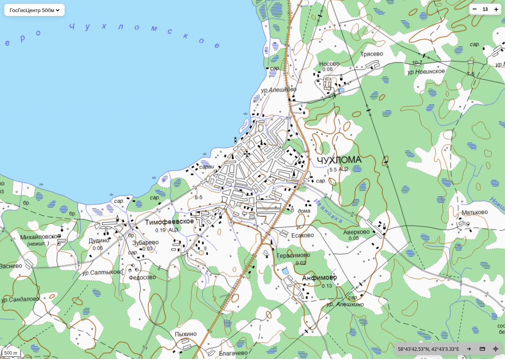

# Map UI

Минималистичный веб-интерфейс на Leaflet для просмотра тайловых карт с возможностью переключения источников, линейкой, «прыжком» к координатам и их отображением.

Проект разделён на фронтенд (`app/mapui/`) и примеры конфигурации Nginx (`contrib/`) с njs-роутером для тайлов.

## Возможности
* Переключение источников карт (tile layers).
* Панель «инструменты»:
  * Отображение координат текущего клика и переход по заданным координатам. Парсер координат понимает оба формата ввода:
    * десятичные: 58.75258, 42.65622
    * DMS: 56°40'05.89"N, 42°47'45.12"E (допустимы * вместо °, разные кавычки минут/секунд, N/S/E/W — в начале или в конце).
  * Линейка
  * Геолокации
  * URL тайлов: /tiles/{maptype}/{z}/{x}/{y}[.ext], проксируются в файловую схему хранения кеша SAS.Planet через njs.

## Screenshot



## Сборка
```
cd apps/map-ui
npm run build
# содержимое apps/map-ui/dist/ положите в корневой каталог веб-сервера
```

## Схема тайлов
На диске ожидается структура:
```
/data/maps/<Base>/z<Z>/<Xdir>/x<X>/<Ydir>/y<Y>.<ext>
где Xdir = floor(X / 1024), Ydir = floor(Y / 1024)
```

Примеры сопоставлений в `contrib/nginx/maptiles.js`:
```
const maps = {
  topo:   { kind: 'sas', base: 'Topomapper',         ext: 'jpg' },
  sat:    { kind: 'sas', base: 'Esri-Clarity-Cache', ext: 'jpg' },
  ggc250: { kind: 'sas', base: 'GGC250',             ext: 'png' },
  ggc500: { kind: 'sas', base: 'GGC500',             ext: 'png' },
};
```

## Настройка исходных слоёв и стартового вида
Отредактируйте apps/map-ui/src/config.js:
```
export const INITIAL_VIEW = { lat: 58.75258, lon: 42.65622, zoom: 13 };

export const SOURCES = [
  { key: 'sat',  name: 'Satellite', url: '/tiles/sat/{z}/{x}/{y}',  options: { maxNativeZoom: 18, maxZoom: 19, noWrap: true } },
  { key: 'topo', name: 'Topomap',   url: '/tiles/topo/{z}/{x}/{y}', options: { maxZoom: 19, noWrap: true } },
  // ...
];
```

## Deploy
В проекте тайлы отдаются `Nginx` через JavaScript-роутер на njs. Это нужно для того, чтобы на лету переводить привычные клиенту запросы вида `/tiles/{maptype}/{z}/{x}/{y}[.ext]` в «шардированную» файловую схему кэша **SAS.Planet**, где тайлы лежат по таким путям:
```
/maps/<Base>/z<Z>/<Xdir>/x<X>/<Ydir>/y<Y>.<ext>
где  Xdir = floor(X / 1024),  Ydir = floor(Y / 1024)
```

Логика следующая: njs-скрипт читает из запроса `maptype, z, x, y` (и, при наличии, `ext`), выбирает конфигурацию карты из словаря `maps[maptype]` (там задана папка `Base`, расширение, и тип — `sas` или `xyz`), затем вычисляет директории шардинга:
```
const Xdir = Math.floor(x / 1024);
const Ydir = Math.floor(y / 1024);
const Zdir = m.zPlusOne ? (z + 1) : z;
const target = `/maps/${m.base}/z${Zdir}/${Xdir}/x${x}/${Ydir}/y${y}.${m.ext}`;
```
После этого роутер возвращает внутренний URI (`/maps/...`), а Nginx отдаёт соответствующий файл с диска через `try_files`. Для источников, у которых кэш уже плоский (xyz), роутер формирует путь напрямую как `/maps/<Base>/<z>/<x>/<y>.<ext>` — без шардинга.

Для работы такого роутинга нужен модуль `njs` (nginx JavaScript module), чтобы подключить скрипт (js_import ...) и использовать его в js_set для вычисления внутреннего пути.
